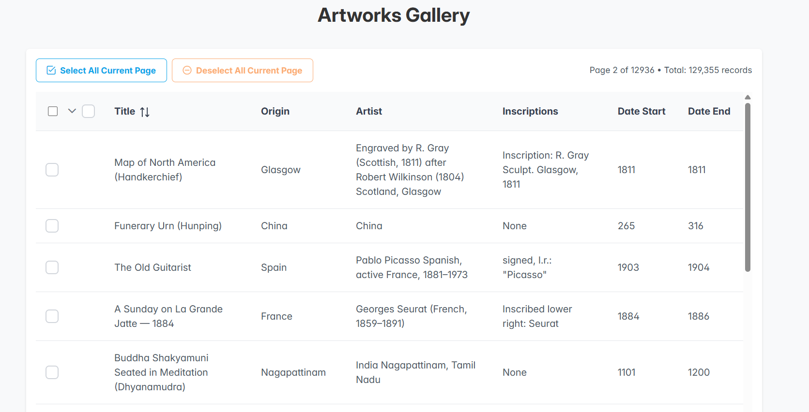
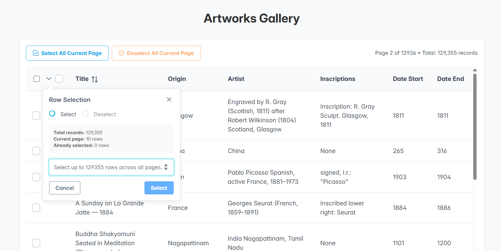
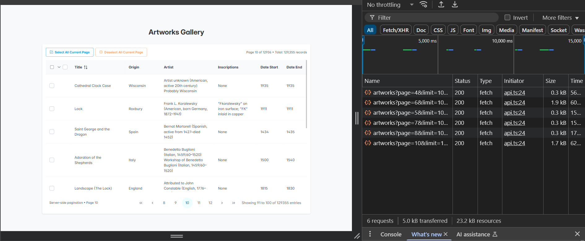

# Artworks Gallery - React Data Table with Persistent Selection

A React application showcasing server-side pagination with persistent row selection across pages, built with PrimeReact components and TypeScript.


*Main table view showing artwork data with selection controls and pagination*

## Features

### 🎨 **Artwork Data Display**
- Displays artwork data from the Art Institute of Chicago API
- Shows artwork title, origin, artist, inscriptions, and date ranges
- Responsive table design with proper word wrapping
- Loading states and error handling

### 📊 **Server-Side Pagination**
- True server-side pagination (only loads current page data)
- 10 rows per page with full pagination controls
- Efficient data fetching - only requests needed data
- Page navigation with loading indicators

### ✅ **Advanced Row Selection**
- **Individual Selection**: Click checkboxes to select/deselect rows one by one
- **Bulk Selection**: Use the advanced selection panel for bulk operations
- **Header Checkbox**: Select/deselect all rows on current page with tri-state support
- **Persistent Selection**: Selections maintained across page navigation
- **No Limits**: Select unlimited number of rows across all pages

### 🔧 **Selection Controls**
- **Custom Selection Panel**: Advanced dropdown with select/deselect modes
- **Smart Validation**: Prevents invalid operations (e.g., deselecting when nothing is selected)
- **Visual Feedback**: Clear indication of selected rows and counts
- **Keyboard Support**: Enter key support in input fields


*Advanced selection dropdown allowing bulk select/deselect operations*


*Network tab showing efficient server-side pagination - only current page data is fetched*

## Project Structure

```
src/
├── components/
│   ├── ActionButtons.tsx              # Select/Deselect all current page buttons
│   ├── ArtworkDataTable.tsx          # Main data table component
│   ├── ArtworkPagination.tsx         # Pagination component
│   ├── ArtworksTable.tsx             # Main orchestrating component
│   ├── ColumnTemplates.tsx           # Custom column body templates
│   ├── RowSelectionPopup.tsx         # Advanced selection panel
│   ├── SelectionHeader.tsx           # Custom table header with dropdown
│   ├── SelectionInfo.tsx             # Selection count display
│   ├── types.ts                      # TypeScript interfaces
│   └── useArtworkData.ts             # Data fetching hook
├── hooks/
│   └── usePersistentSelection.ts     # Custom hook for selection state
├── services/
│   └── api.ts                        # API service for artwork data
├── App.tsx                           # Main app component
├── main.tsx                          # App entry point
└── index.css                         # Global styles
```

## Technologies Used

- **React 18** with TypeScript
- **PrimeReact** - UI component library
- **PrimeFlex** - CSS utility framework
- **PrimeIcons** - Icon library
- **Art Institute of Chicago API** - Data source

## Installation

```bash
# Clone the repository
git clone <repository-url>
cd artworks-app

# Install dependencies
npm install

# Start development server
npm run dev
```

## Usage

### Basic Selection
1. **Individual Rows**: Click the checkbox next to any row to select/deselect it
2. **All Current Page**: Use the header checkbox to select/deselect all rows on the current page
3. **Navigation**: Switch between pages - your selections are preserved

### Advanced Selection
1. Click the **chevron dropdown** (▼) in the table header
2. Choose **Select** or **Deselect** mode
3. Enter the number of rows you want to select/deselect
4. Click the action button to apply

### Selection Features
- **Persistent State**: Your selections remain when navigating between pages
- **Visual Feedback**: Selected row count displayed above the table
- **Smart Controls**: Buttons automatically enable/disable based on current state
- **Validation**: Prevents selecting more rows than available

## Component Architecture

The application follows a modular component architecture for better maintainability:

### Core Components

- **ArtworksTable**: Main orchestrating component that manages state and coordinates child components
- **ArtworkDataTable**: Renders the data table with custom selection logic
- **SelectionHeader**: Custom header with checkbox and dropdown for advanced options
- **ActionButtons**: Quick select/deselect buttons for current page

### UI Components

- **SelectionInfo**: Displays current selection count
- **ArtworkPagination**: Handles pagination controls
- **RowSelectionPopup**: Advanced selection modal with bulk operations

### Utilities

- **useArtworkData**: Custom hook for data fetching and caching
- **usePersistentSelection**: Manages selection state across pages
- **ColumnTemplates**: Reusable column formatting functions

## API Integration

The application integrates with the Art Institute of Chicago API:

```typescript
// Fetches artwork data with pagination
const response = await fetch(
  `https://api.artic.edu/api/v1/artworks?page=${page}&limit=10&fields=id,title,place_of_origin,artist_display,inscriptions,date_start,date_end`
);
```

### Data Flow
1. **Server-side Pagination**: Only current page data is fetched
2. **Efficient Caching**: Previously fetched data is stored for selection operations
3. **Cross-page Selection**: Fetches additional pages when needed for bulk operations

## Key Features in Detail

### Persistent Selection System
- Maintains selection state using Set data structure for O(1) lookup
- Preserves selections when navigating between pages
- Handles large datasets efficiently (129,355+ records)

### Advanced Bulk Operations
- Select/deselect multiple rows starting from current page
- Intelligent validation prevents invalid operations
- Real-time feedback on available operations

### Responsive Design
- Mobile-friendly interface
- Adaptive column widths
- Touch-optimized controls

## Styling

The application uses a combination of:
- **PrimeReact themes** - Base component styling
- **PrimeFlex** - Utility classes for layout
- **Custom CSS** - Enhanced styling for specific features

Key style features:
- Responsive design for mobile devices
- Hover effects and visual feedback
- Loading states and transitions
- Consistent color scheme and typography

## Performance Considerations

- **Server-side pagination** - Only loads necessary data
- **Efficient re-renders** - Optimized selection state updates
- **Lazy loading** - Data fetched on demand
- **Memory management** - Proper cleanup of selection state
- **Component modularity** - Better React optimization through smaller components

## Browser Support

- Modern browsers supporting ES2020+
- React 18+ features
- CSS Grid and Flexbox support

## Development

### Adding New Features
1. Create new components in the `src/components/` directory
2. Use the existing TypeScript interfaces in `types.ts`
3. Follow the modular architecture pattern
4. Update tests accordingly

### Code Organization
- **Single Responsibility**: Each component has one clear purpose
- **Type Safety**: Full TypeScript coverage
- **Reusability**: Components designed for reuse
- **Maintainability**: Clear separation of concerns

## Contributing

1. Fork the repository
2. Create a feature branch (`git checkout -b feature/amazing-feature`)
3. Commit your changes (`git commit -m 'Add amazing feature'`)
4. Push to the branch (`git push origin feature/amazing-feature`)
5. Open a Pull Request

## Screenshots

### Main Interface


The main table view displays artwork data with:
- Individual row checkboxes for selection
- Header checkbox with dropdown for advanced options
- Action buttons for quick operations
- Page information and navigation controls

### Selection Panel


The advanced selection panel provides:
- Select/Deselect mode toggle
- Input field for specifying row count
- Real-time validation and feedback
- Information about current selection state

### Server-Side Pagination Performance


Network performance demonstration showing:
- **Efficient API calls**: Only 6 requests total with 5.0 kB transferred
- **True server-side pagination**: Each page fetches only 10 records (0.3-1.9 kB per request)
- **Fast response times**: 56-62ms average response time
- **Optimized data transfer**: Minimal bandwidth usage even with 129,355+ total records
- **Smart caching**: Previously fetched data is stored for selection operations

### Key UI Elements
- **Selection Count**: Displays total selected rows across all pages
- **Smart Buttons**: Automatically enable/disable based on current state
- **Visual Feedback**: Clear indication of selected items
- **Responsive Layout**: Adapts to different screen sizes

## License

This project is licensed under the MIT License - see the LICENSE file for details.

---

**Built with ❤️ using React and PrimeReact**

## Changelog

### v2.0.0 - Component Refactoring
- Broke down monolithic component into 9+ smaller components
- Improved maintainability and testability
- Enhanced type safety with dedicated interfaces
- Better separation of concerns

### v1.0.0 - Initial Release
- Server-side pagination implementation
- Persistent selection across pages
- Advanced bulk selection operations
- Integration with Art Institute of Chicago API
